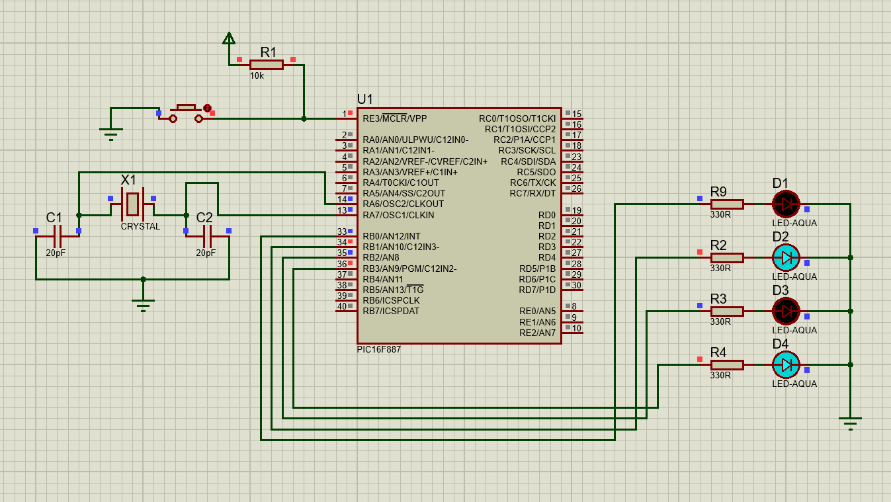
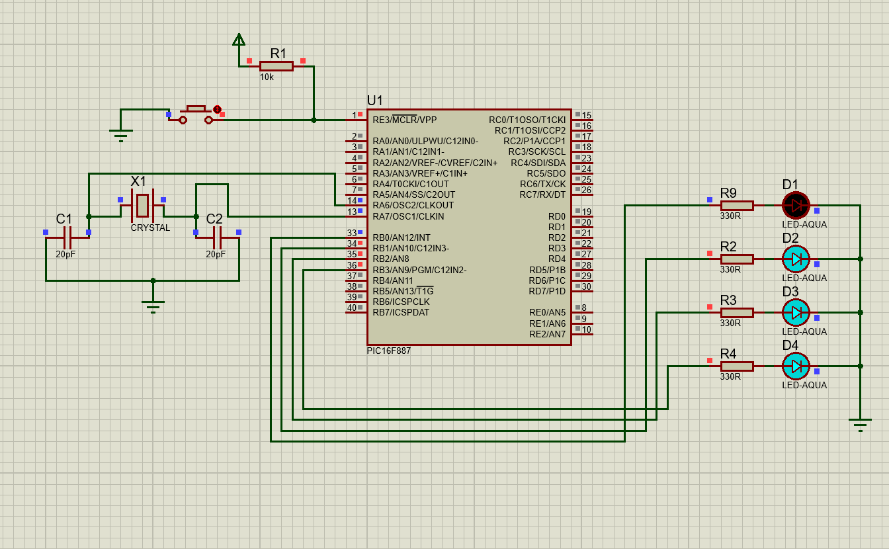
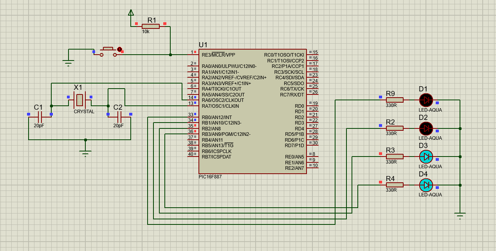

# Blinking_4_LEDs_Without_delay()

## Description
This project demonstrates how to blink 4 LEDs at different frequencies (100ms, 200ms, 300ms, and 400ms) using a timer instead of the `delay()` function.

## Circuit
 
 
 
*The circuit schematic for 4 LEDs.*

## Files
- `circuit.png`: Circuit schematic for 4 LEDs.
- `code.c`: MikroC program using timer-based delays.

## Instructions
1. Set up the circuit as shown in `circuit.png`.
2. Compile `code.c` in MikroC to generate the hex file.
3. Load the hex file into the microcontroller in Proteus.
4. Run the simulation to observe the LEDs blinking at different intervals.

## Tools
- MikroC Pro for PIC
- Proteus ISIS
